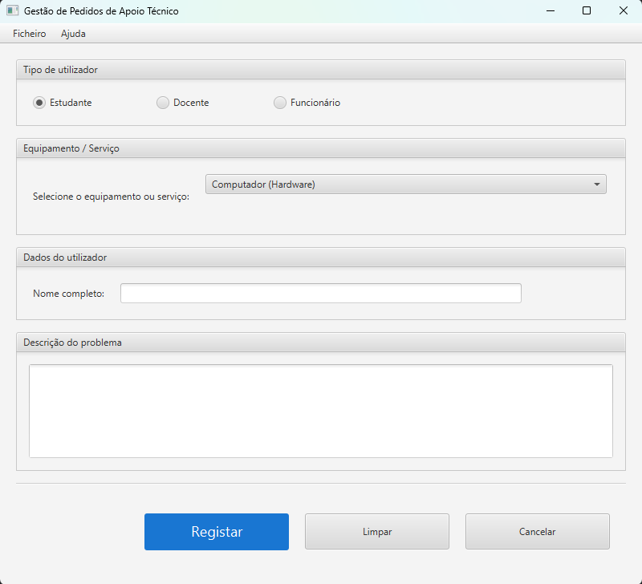

# Ficha de Laboratório #09 - Introdução ao JavaFX 

## Gestão de Pedidos de Apoio Técnico

## Objetivo

Desenvolver uma aplicação JavaFX para registar pedidos de apoio técnico, seguindo o desenho da interface apresentado.

Sempre que o utilizador submeter o formulário, deverá ser criado um objeto da classe `Request`, contendo toda a informação introduzida na interface.

As classes `Equipment` e `Request` serão disponibilizadas no projeto github https://github.com/estsetubal-poo-2526/Laboratorio9 e deverão ser utilizadas na implementação da aplicação.


<center>

</center>

## Nível 1 — Implementar a Interface

Verifique que o template se encontra organizado em MVC, Model-View-Controler.
Dentro da pasta *view*, tem a classe **MainWindow** onde deverá implementar a interface gráfica da aplicação, seguindo o mockup apresentado.

Nesta fase, a aplicação deve apenas abrir a janela com todos os componentes corretamente organizados.
Estratégia sugerida

1. Identifique os layouts a utilizar  
2. Identifique os controlos a utilizar  
3. Elabore a árvore de nós (Node)  
4. Implemente a árvore especificada  

---

## Nível 2 — Associar a ComboBox à Lista de Equipamentos

Crie uma lista de objetos `Equipment` e associe-a à ComboBox da interface.

Exemplo:

```java
List<Equipment> equipments = List.of(
    new Equipment("Computador", "Hardware"),
    new Equipment("Impressora", "Hardware"),
    new Equipment("Rede Wi-Fi", "Rede"),
    new Equipment("Moodle", "Software"),
    new Equipment("Email Institucional", "Software")
);
```

---

## Nível 3 — Criar um Objeto `Request`

Prepare o programa para que ao clicar no botão de registo:

1. Recolha os dados introduzidos pelo utilizador.
2. Crie um objeto `Request`.
3. Apresente o conteúdo do pedido na consola utilizando o método `toString()`.

Exemplo:

```java
Request request = new Request(
    userType,
    name,
    selectedEquipment,
    description
);
```

Ao clicar no botão **Clear**, todos os campos e seleções devem ser repostos ao estado inicial.

---

## Nível 4 — Implementar as ações do MenuBar


Relativamenet ao Menu Bar implemente as seguintes ações:

* **Novo Pedido** → limpa o formulário;
* **Sair** → fecha a aplicação;
* **Ajuda** → apresenta uma janela com informação sobre a aplicação.

---
## Nível 5 — Adicionar novo equipamento

Adicione à `ComboBox` uma opção chamada **Other Equipment**.

Quando o utilizador selecionar essa opção, deverá aparecer um `TextField` que permita introduzir o nome de um novo equipamento.

Depois de introduzido, esse equipamento deverá ser criado como um novo objeto `Equipment` e adicionado à lista de equipamentos disponíveis.

A partir desse momento, o novo equipamento deverá também ficar disponível na `ComboBox`.

Exemplo:

```java
Equipment newEquipment = new Equipment(otherEquipmentName, "Other");
```

A aplicação deverá garantir que:

* o campo para introduzir o novo equipamento só aparece quando a opção **Other Equipment** está selecionada;
* o novo equipamento é adicionado à coleção;
* a `ComboBox` é atualizada com o novo equipamento;
* o novo equipamento pode ser usado na criação de um objeto `Request`.

---

### Notas:

Para os identificadores siga as convenções adotadas normalmente, em particular:
1. A notação **camelCase** para o nome das variáveis locais e identificadores de atributos e métodos;
2. A notação **PascalCase** para os nomes das classes e interfaces;
3. A notação **SCREAMING_SNAKE_CASE** para as constantes e os valores de **enum**;
4. Não utilize o símbolo `_` (exceto em constantes), nem abreviaturas pouco claras nos identificadores.